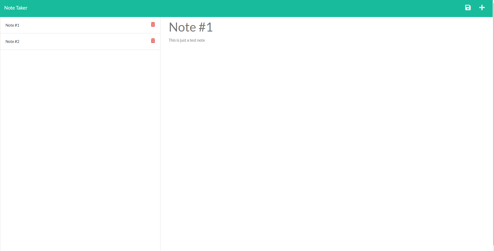

# Note Taker App

## Description

This note taker app can be used to write and save user inputs as notes. It utilizes express.js for the backend to that serve up html and api routes. And uses

This project is a note taker app that can be used to write, save, and delete user inputs as notes. It utilizes express.js as the backend, handling the html and api routes.

---

## Table of contents

- [Installation](#installation)
- [Usage](#usage)
- [Credits](#credits)
- [License](#license)
- [Features](#features)
- [Contribution](#contribution)
- [Tests](#tests)

---

## Installation

Below is the following installing steps to install and run this app.

1. Clone this repo

```sh
git clone git@github.com:T3mpz/Note-taker.git
```

2. Install NPM packages/dependencies

```sh
npm i
```

3. Start the server

```sh
nodemon server.js
```

4. Access website via

```sh
http://localhost:3001/
```

---

## Usage



---

## Credits

- [T3mpz](https://github.com/T3mpz)

---

## License

N/A

---

## Badges

[](https://www.javascript.com)
[](https://nodejs.org/en/)
[](http://expressjs.com/)

---

## Features

Below is a code example of one of the express.js routes

```
router.post("/notes", (req, res) => {
  const { title, text } = req.body;

  const createNewNote = (title, text) => {
    const newNote = {
      title,
      text,
      id: uuid(),
    };
    db.push(newNote);
    fs.writeFileSync("./db/db.json", JSON.stringify(db));
    res.json(db);
  };
  return title && text ? createNewNote(title, text) : console.log("error");
});
```

---

## Contribution

N/A

---

## Tests

N/A
